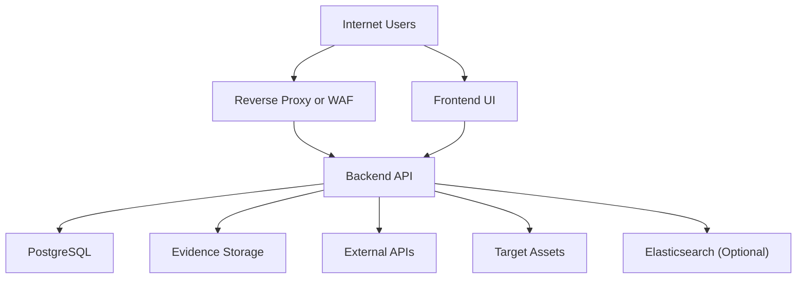

## Executive summary
The highest risks cluster around authentication and control surfaces for scanning and discovery in an Internet-exposed deployment: misconfigured auth (empty API keys), API key leakage, and abuse of scan/discovery endpoints could lead to full data compromise or misuse of the scanning engine. Cross-origin configuration and cookie-based sessions create a meaningful CSRF/data-exfil risk if CORS is permissive, and the settings API can expose third-party secrets once an admin credential is compromised. Evidence and asset data may include inadvertently exposed sensitive data, so regulatory and contractual exposure (privacy laws and breach notification obligations) should be treated as a first-class risk.

## Scope and assumptions
In-scope paths: `backend/src`, `backend/migrations`, `frontend/src/app/api.ts`, `frontend/src/app/*`.
Out-of-scope items: `docs/`, `backend/tests/`, `frontend` build configs, `docker-compose.*`, local developer tooling and CI/CD pipelines (no evidence in repo).
Assumptions:
- The backend API is Internet-exposed behind TLS/ingress with a reverse proxy and optional WAF, and the proxy terminates TLS. (Deployment context provided by user; not in repo.)
- Single-tenant deployment per organization, with `company_id` used for sub-company partitioning within the tenant. (Deployment context provided by user; see usage in `backend/src/middleware/auth.rs`.)
- Data stored is publicly sourced but may include sensitive or accidentally exposed information; privacy and compliance constraints apply. (Deployment context provided by user.)

Open questions that could materially change risk ranking:
- Is there any additional auth boundary at the reverse proxy (mTLS, IP allowlists, or SSO) for admin endpoints?
- Is evidence storage encrypted at rest and isolated per tenant in the deployment environment?
- Are there operational controls for scan authorization (allowlists, customer consent workflows, or legal review) beyond application settings?

## System model
### Primary components
- Backend API service (Axum, Rust) providing REST endpoints, middleware, and background task execution for discovery and scanning. Evidence: `backend/src/main.rs`, `backend/src/lib.rs`, `backend/src/services/task_manager.rs`.
- PostgreSQL database for assets, findings, users, settings, and lineage, with migrations at startup. Evidence: `backend/src/database.rs`, `backend/migrations/*`.
- Evidence file storage on local filesystem path configured via settings. Evidence: `backend/src/handlers/evidence_handlers.rs`, `backend/src/handlers/static_handlers.rs`, `backend/src/config.rs`.
- Optional Elasticsearch integration for search features when configured. Evidence: `backend/src/lib.rs`.
- External integrations for OSINT and threat intel (Shodan, VirusTotal, CertSpotter, crt.sh), using API keys. Evidence: `backend/src/services/external/manager.rs`, `backend/src/config.rs`.
- Frontend Next.js client that calls the API with credentials and optional `X-Company-ID` header. Evidence: `frontend/src/app/api.ts`.

### Data flows and trust boundaries
- Internet user/browser -> Reverse proxy/WAF -> Backend API; data: auth cookies, API keys, JSON payloads; channel: HTTPS; guarantees: TLS termination and WAF filtering at proxy; validation: auth middleware and RBAC checks. Evidence: `backend/src/main.rs`, `backend/src/middleware/auth.rs`.
- Browser-based UI -> Backend API; data: session cookie and JSON; channel: HTTPS with credentials; guarantees: SameSite Lax cookies, CORS allowlist; validation: auth middleware. Evidence: `backend/src/handlers/auth_handlers.rs`, `backend/src/middleware/cors.rs`, `frontend/src/app/api.ts`.
- Backend API -> PostgreSQL; data: assets, findings, users, settings; channel: TCP with connection string; guarantees: DB auth and network ACLs (deployment); validation: SQLx queries with app-level company scoping. Evidence: `backend/src/database.rs`, `backend/src/lib.rs`.
- Backend API -> Evidence filesystem; data: uploaded artifacts and metadata; channel: local filesystem IO; guarantees: size/type validation and path canonicalization when serving; validation: file type allowlist and traversal checks. Evidence: `backend/src/handlers/evidence_handlers.rs`, `backend/src/handlers/static_handlers.rs`.
- Backend API -> External APIs (Shodan, VirusTotal, CertSpotter, crt.sh); data: domains/IPs and API tokens; channel: HTTPS; guarantees: outbound TLS via reqwest; validation: external provider responses parsed by app. Evidence: `backend/src/services/external/manager.rs`, `backend/src/services/external/http.rs`.
- Backend API -> Target assets on the Internet; data: DNS queries, TCP connect probes, HTTP requests, TLS handshakes; channel: DNS/TCP/HTTPS; guarantees: rate limits in HTTP probing and optional internal IP blocking; validation: internal IP checks where enabled. Evidence: `backend/src/services/security_scan_service.rs`, `backend/src/services/scan_service.rs`, `backend/src/utils/network.rs`.
- Backend API -> Elasticsearch (optional); data: indexed assets and findings; channel: HTTP; guarantees: only enabled when configured. Evidence: `backend/src/lib.rs`.

#### Diagram

## Assets and security objectives
| Asset | Why it matters | Security objective (C/I/A) |
| --- | --- | --- |
| API keys and OIDC client secrets | Enable full admin access and external API usage; compromise leads to total control and abuse of integrations. | C/I |
| Session signing secret (`auth_secret`) | Protects integrity of session cookies; compromise enables session forgery. | C/I |
| PostgreSQL data (assets, findings, users, settings) | Core tenant data and security posture; loss affects confidentiality and integrity. | C/I/A |
| Evidence files on disk | May contain sensitive artifacts and screenshots; leakage creates privacy and compliance risk. | C/I |
| Scan/discovery task execution | Controls outbound scanning and reconnaissance; abuse can cause legal and reputational harm. | I/A |
| External API quotas and reputations | Abuse can trigger bans, financial loss, or API lockouts. | C/A |
| Audit logs and metrics | Required for detection, forensics, and compliance. | I/A |

## Attacker model
### Capabilities
- Remote Internet attacker can reach public endpoints through the reverse proxy/WAF.
- Can attempt to steal credentials or API keys (phishing, token leakage, supply chain, insider error).
- If authenticated, can submit discovery/seeds, scans, tags, settings updates, and search operations.
- Can influence data returned by external OSINT providers or by target assets probed during scanning.

### Non-capabilities
- No direct filesystem or database access without first compromising the API or infrastructure.
- No privileged access to internal networks unless scan endpoints allow internal targets or network routing permits it.
- No direct code execution or deployment control assumed.

## Entry points and attack surfaces
| Surface | How reached | Trust boundary | Notes | Evidence (repo path / symbol) |
| --- | --- | --- | --- | --- |
| `GET /api/health*` | Public HTTP | Internet -> API | Liveness/readiness endpoints. | `backend/src/main.rs` (public routes) |
| `GET /api/auth/*`, `POST /api/auth/login`, `POST /api/auth/logout` | Public HTTP | Internet -> API | OIDC and local login; sets session cookie. | `backend/src/main.rs`, `backend/src/handlers/auth_handlers.rs` |
| `GET /api/auth/me` | Authenticated HTTP | Browser/API -> API | Returns user context and company scope. | `backend/src/main.rs`, `backend/src/handlers/auth_handlers.rs` |
| `POST /api/discovery/run`, `POST /api/discovery/stop` | Authenticated HTTP | Browser/API -> API | Triggers discovery jobs with outbound scanning. | `backend/src/main.rs`, `backend/src/services/discovery_service.rs` |
| `POST /api/security/scans`, `POST /api/security/scans/:id/cancel` | Authenticated HTTP | Browser/API -> API | Triggers active scans and outbound probes. | `backend/src/main.rs`, `backend/src/services/security_scan_service.rs` |
| `GET /api/search/*`, `POST /api/search/reindex` | Authenticated HTTP | Browser/API -> API | Search index management (optional ES). | `backend/src/main.rs`, `backend/src/lib.rs` |
| `PATCH /api/admin/settings` | Authenticated HTTP (Admin) | Browser/API -> API | Updates secrets and critical security settings. | `backend/src/main.rs`, `backend/src/handlers/settings_handlers.rs` |
| `GET /api/admin/users` and user role updates | Authenticated HTTP (Admin) | Browser/API -> API | User management and RBAC. | `backend/src/main.rs`, `backend/src/handlers/admin_handlers.rs` |
| `POST /api/tags/run-auto-tag-all` | Authenticated HTTP | Browser/API -> API | Potentially expensive batch operation. | `backend/src/main.rs`, `backend/src/handlers/tag_handlers.rs` |
| `GET /api/metrics*` | Authenticated HTTP | Browser/API -> API | Returns health/perf data; can expose operational info. | `backend/src/main.rs`, `backend/src/handlers/metrics_handlers.rs` |

## Top abuse paths
1. Goal: Unauthenticated access to all tenant data. Steps: misconfigure `API_KEYS` empty -> auth middleware allows all requests -> attacker calls protected endpoints -> full data read/write and scan control. Impact: full compromise of confidentiality and integrity.
2. Goal: Admin takeover via API key theft. Steps: attacker obtains API key from logs/config/CI -> uses `X-API-Key` and arbitrary `X-Company-ID` -> accesses admin settings and user management -> exfiltrates secrets and data. Impact: full compromise and abuse of scanning.
3. Goal: Cross-origin data exfiltration. Steps: `CORS_ALLOW_ORIGINS` set to `*` or empty -> browser sends credentialed requests from attacker site -> attacker reads API responses -> data leakage. Impact: confidentiality breach.
4. Goal: Internal network recon via scanner. Steps: attacker gains auth -> disables internal IP block or targets allowed internal ranges -> triggers discovery or scan -> backend probes internal services. Impact: internal network exposure and lateral movement facilitation.
5. Goal: Cross-company data exposure inside a single tenant. Steps: attacker with valid session manipulates `X-Company-ID` or exploits missing company scoping -> reads or mutates data from other sub-companies. Impact: internal tenant isolation failure.
6. Goal: Secret leakage from settings. Steps: attacker compromises admin account or API key -> calls settings endpoint with secret reveal -> obtains third-party API keys and OIDC secrets -> further compromise. Impact: credential theft and extended abuse.
7. Goal: Evidence data exfiltration or privacy breach. Steps: attacker gains access to evidence download surfaces or misrouted static file server -> downloads stored artifacts -> obtains sensitive content. Impact: privacy/compliance exposure.
8. Goal: Resource exhaustion DoS. Steps: attacker floods discovery/scan endpoints or triggers expensive operations within allowed limits -> task queues saturate -> API becomes unavailable. Impact: service degradation and backlog loss.

## Threat model table
| Threat ID | Threat source | Prerequisites | Threat action | Impact | Impacted assets | Existing controls (evidence) | Gaps | Recommended mitigations | Detection ideas | Likelihood | Impact severity | Priority |
| --- | --- | --- | --- | --- | --- | --- | --- | --- | --- | --- | --- | --- |
| TM-001 | Remote attacker | `API_KEYS` empty or misconfigured in an Internet-exposed deployment | Access protected endpoints without auth | Full data compromise, scan abuse | DB data, scan engine, secrets | Auth middleware enforces API key or session when configured. Evidence: `backend/src/middleware/auth.rs` | Dev-mode bypass when `api_keys` empty; no startup guard | Fail startup in production if auth not configured; add explicit `ALLOW_ANON=false` gate; enforce WAF allowlist for admin paths | Alert on startup when auth disabled; track anonymous requests | Medium | High | High |
| TM-002 | External attacker with stolen API key | API key leaked from config, logs, or operator error | Use API key as admin and set arbitrary `X-Company-ID` | Full admin access and cross-company data access | DB data, settings, external API keys | API key header check and RBAC roles. Evidence: `backend/src/middleware/auth.rs`, `backend/src/auth/context.rs` | API keys grant admin role and are not scoped; no rotation or hashing indicated | Use scoped tokens per user/service; store hashed keys; rotate keys; bind to IP/mTLS or client certs | Audit API key usage, alert on new IPs or high-risk actions | Medium | High | High |
| TM-003 | Malicious website operator | Permissive CORS with credentials and cookie-based sessions | Cross-origin reads or state changes via browser | Data exfiltration or unauthorized actions | DB data, settings | CORS allowlist and SameSite Lax cookies. Evidence: `backend/src/middleware/cors.rs`, `backend/src/handlers/auth_handlers.rs` | `CORS_ALLOW_ORIGINS` empty or `*` allows mirror-request + credentials; no CSRF tokens | Enforce strict origin allowlist in production; reject `*` with credentials; add CSRF tokens for state-changing requests | Monitor CORS config changes; log Origin header anomalies | Medium | Medium | Medium |
| TM-004 | Authenticated attacker | Access to discovery/scan endpoints; internal IP block disabled or bypassed | Use scanner as SSRF to probe internal or sensitive targets | Internal network exposure, legal abuse | Scan engine, network trust boundaries | Internal IP blocking and scan limits. Evidence: `backend/src/services/scan_service.rs`, `backend/src/services/security_scan_service.rs`, `backend/src/utils/network.rs` | Blocking can be disabled; no explicit allowlist for targets | Enforce allowlists for targets; require approval workflow for internal ranges; hard-block RFC1918 unless explicitly allowed by policy | Alert on internal IP targets or unusual scan destinations | Medium | High | High |
| TM-005 | Authenticated user | Missing company scoping in any handler or repository | Cross-company access via ID manipulation | Data leakage across sub-companies | DB data | Company resolution in auth middleware. Evidence: `backend/src/middleware/auth.rs` | No centralized enforcement guarantees all repo queries are scoped | Add mandatory company_id filters at repository layer; add tests for cross-company access | Audit log access by company_id; anomaly detection | Low | High | Medium |
| TM-006 | Admin compromise | Admin account or API key stolen | Use settings API to reveal secrets and modify security settings | Secret exfiltration and long-term persistence | API keys, OIDC secrets, auth settings | Admin role required for settings. Evidence: `backend/src/handlers/settings_handlers.rs` | API key is admin by default; no MFA or break-glass controls | Require re-auth or MFA for secret reveal; limit reveal_secrets to break-glass; store secrets in KMS | Log and alert on reveal_secrets usage | Medium | High | High |
| TM-007 | Authenticated attacker or misconfiguration | Evidence download/upload endpoints exposed without strict auth or isolation | Exfiltrate or tamper with evidence files | Privacy/compliance breach | Evidence files, filesystem | File size/type validation and path canonicalization. Evidence: `backend/src/handlers/evidence_handlers.rs`, `backend/src/handlers/static_handlers.rs` | No explicit auth checks inside handlers; local filesystem may be shared or unencrypted | Enforce auth at routing layer; consider object storage with signed URLs; encrypt at rest; per-tenant storage separation | Monitor evidence downloads and disk usage | Low | Medium | Medium |
| TM-008 | Authenticated attacker | Ability to trigger discovery/scan jobs at scale | Queue saturation and resource exhaustion | Service degradation and missed scans | Task system, API availability | Concurrency controls and CIDR limits. Evidence: `backend/src/services/task_manager.rs`, `backend/src/services/scan_service.rs` | Rate limiting middleware not applied; no per-user quotas | Apply rate limiting middleware; add per-user quotas and job limits; backpressure in task submission | Metrics on task queue depth and request rates; alerts on surge | High | Medium | Medium |

## Criticality calibration
Critical means remote compromise of the tenant or scanning engine with broad impact and minimal prerequisites.
- Examples: unauthenticated access to protected endpoints when auth is disabled; arbitrary internal network scanning from the backend; database exfiltration.
High means authenticated compromise of sensitive data or security controls with significant impact.
- Examples: API key theft leading to admin access; settings API secret reveal; cross-company access within a tenant.
Medium means meaningful disruption or data exposure with constraints or smaller blast radius.
- Examples: DoS via task flooding; evidence file exposure limited to accessible artifacts; cross-origin data leakage under misconfigured CORS.
Low means limited or noisy issues with easy mitigation and low data impact.
- Examples: minor information leaks from health endpoints or verbose error messages.

## Focus paths for security review
| Path | Why it matters | Related Threat IDs |
| --- | --- | --- |
| `backend/src/middleware/auth.rs` | Central auth logic, API key behavior, company resolution. | TM-001, TM-002, TM-005 |
| `backend/src/middleware/cors.rs` | CORS policy and credential handling affecting CSRF/data exfil. | TM-003 |
| `backend/src/handlers/auth_handlers.rs` | Session cookie creation and Secure/SameSite logic. | TM-003, TM-006 |
| `backend/src/handlers/settings_handlers.rs` | Admin settings updates and secret reveal controls. | TM-006 |
| `backend/src/services/scan_service.rs` | Discovery scanning flow and internal IP blocking. | TM-004, TM-008 |
| `backend/src/services/security_scan_service.rs` | Active scanning and outbound probes. | TM-004, TM-008 |
| `backend/src/services/external/manager.rs` | External API integrations and key usage. | TM-006 |
| `backend/src/handlers/evidence_handlers.rs` | Evidence upload/download controls and file handling. | TM-007 |
| `backend/src/handlers/static_handlers.rs` | Static file serving and path traversal defense. | TM-007 |
| `backend/src/middleware/rate_limit.rs` | Rate limiting implementation not wired into main router. | TM-008 |
| `backend/src/main.rs` | Route exposure and middleware layering. | TM-001, TM-003, TM-008 |
| `frontend/src/app/api.ts` | Client-side auth behavior and company header usage. | TM-003, TM-005 |

## Quality check
- Entry points discovered in `backend/src/main.rs` are covered in threats and abuse paths.
- Each trust boundary listed in the system model is addressed by at least one threat.
- Runtime paths are separated from tests and docs; CI/build is out of scope.
- User clarifications (Internet exposure, single-tenant, data sensitivity) are reflected in assumptions and risk ranking.
- Assumptions and open questions are explicitly stated.

## Notes on use
- This report is repo-grounded and highlights assumptions where deployment context is not visible in code.
- Evidence anchors are included as repo paths for major claims.
